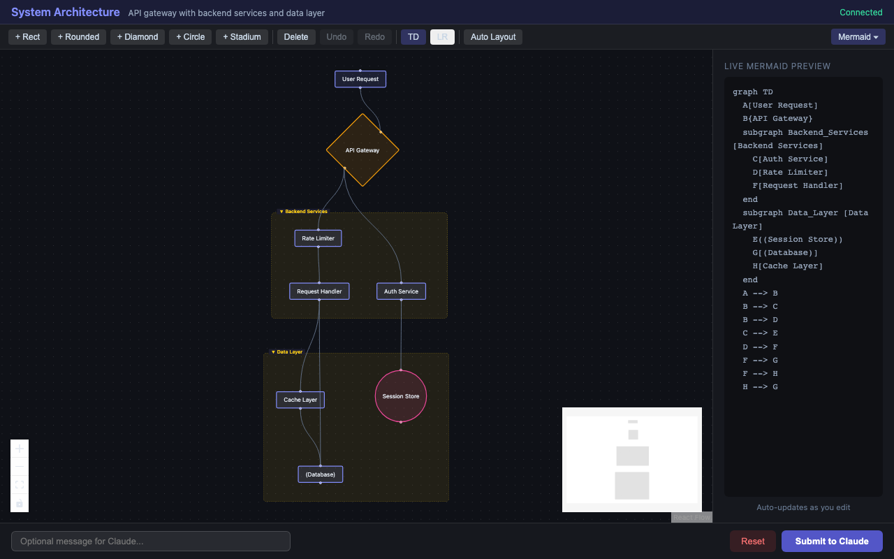

<div align="center">

# 🎨 Mermaid Visual Editor for Claude

**Stop describing diagrams. Start designing them.**

Turn Claude into a visual software design partner with a drag-and-drop Mermaid editor that opens right in your browser.

[](https://github.com/wzh4464/software-design-mermaid-mcp/actions/workflows/test.yml)
[](LICENSE)
[](https://modelcontextprotocol.io)
[](#)
[](#)

[Getting Started](#-getting-started) · [Features](#-features) · [How It Works](#-how-it-works) · [Contributing](#-contributing)

</div>

---

<div align="center">



*Claude generates the diagram, you refine it visually — drag nodes, edit labels, draw connections, then submit back for the next iteration*

</div>

---

## The Problem

When designing software with Claude, you're stuck in a text-only loop:

```
You: "Add a cache layer between the API and database"
Claude: *regenerates entire Mermaid diagram from scratch*
You: "No, move the cache node to the left..."
Claude: *guesses what you mean, regenerates again*
```

**It's like directing a painter blindfolded.**

## The Solution

This MCP server gives Claude a **visual canvas**. When Claude generates a diagram, it pops open a browser-based editor where you can:

- **Drag nodes** exactly where you want them
- **Edit labels** inline with a double-click
- **Draw connections** between any nodes
- **Rearrange everything** and submit back to Claude

Claude sees your visual changes and continues the conversation with full context. **Design together, visually.**

> **What is MCP?** [Model Context Protocol](https://modelcontextprotocol.io) lets AI assistants use external tools. This server gives Claude the ability to open a visual diagram editor — no plugins or extensions needed.

---

## ⚡ Getting Started

### Claude Code (recommended)

```bash
git clone https://github.com/wzh4464/software-design-mermaid-mcp.git
cd software-design-mermaid-mcp
npm install && npm run build
claude mcp add software-design-mermaid node $(pwd)/dist/server/index.js
```

Then just ask Claude:

```
> Design a microservice architecture for a todo app
```

Your browser opens automatically with the visual editor. Edit, submit, iterate. ✨

<details>
<summary><b>VS Code + Claude Extension</b></summary>

Add to your VS Code `settings.json`:

```jsonc
{
  "claude.mcpServers": {
    "software-design-mermaid": {
      "command": "node",
      "args": ["/absolute/path/to/software-design-mermaid-mcp/dist/server/index.js"]
    }
  }
}
```

</details>

<details>
<summary><b>Claude Desktop</b></summary>

Add to `claude_desktop_config.json`:

```jsonc
{
  "mcpServers": {
    "software-design-mermaid": {
      "command": "node",
      "args": ["/absolute/path/to/software-design-mermaid-mcp/dist/server/index.js"]
    }
  }
}
```

</details>

<details>
<summary><b>Cursor</b></summary>

Add to your Cursor MCP settings (`.cursor/mcp.json`):

```jsonc
{
  "mcpServers": {
    "software-design-mermaid": {
      "command": "node",
      "args": ["/absolute/path/to/software-design-mermaid-mcp/dist/server/index.js"]
    }
  }
}
```

</details>

<details>
<summary><b>Windsurf / Cline / Other MCP Clients</b></summary>

Any MCP-compatible client can use this server. The configuration pattern is the same:

- **Command**: `node`
- **Args**: `["/absolute/path/to/software-design-mermaid-mcp/dist/server/index.js"]`
- **Transport**: stdio

Refer to your client's documentation for the exact config file location.

</details>

---

## ✨ Features

| | Feature | Description |
|---|---------|-------------|
| 🖱️ | **Drag-and-Drop Canvas** | Full React Flow editor with zoom, pan, minimap, grid snapping |
| 🔷 | **5 Shapes × 3 Edge Types** | Rectangle, rounded, diamond, circle, stadium + arrow, dotted, thick |
| 📦 | **Subgraphs & Auto-Layout** | Group nodes into nested subgraphs; dagre auto-arranges (TD/LR/BT/RL) |
| 📝 | **Live Mermaid Preview** | See Mermaid code update in real-time as you edit |
| 🔄 | **Multi-Round Iteration** | Edit → Submit → Claude refines → Edit again. **True visual collaboration.** |
| ⏪ | **Undo / Redo** | Full history with Ctrl+Z / Ctrl+Y |
| ⚙️ | **Zero Config** | Auto-finds an open port and launches your browser |

---

## 🧩 How It Works

```
  Claude                    MCP Server                 Browser Editor
    │                          │                            │
    │── show_diagram() ───────>│                            │
    │                          │── starts HTTP server ─────>│
    │                          │── opens browser ──────────>│
    │<── { url, success } ─────│                            │
    │                          │                            │
    │                          │<── polls /api/diagram ─────│
    │                          │── returns diagram ────────>│
    │                          │                            │
    │                          │          user drags nodes, │
    │                          │          edits labels,     │
    │                          │          draws connections │
    │                          │                            │
    │                          │<── POST /api/submission ───│
    │── get_diagram_feedback()>│                            │
    │<── updated mermaid code ─│                            │
    │                          │                            │
    │── show_diagram() ───────>│  (Claude sends new version)│
    │   ...iterate...          │                            │
```

### MCP Tools

| Tool | What it does |
|------|-------------|
| `show_diagram` | Opens the visual editor with a Mermaid flowchart |
| `get_diagram_feedback` | Gets the user's visual edits back as Mermaid code |
| `close_diagram` | Closes the editor session |

---

## 🏗️ Architecture

TypeScript monorepo with npm workspaces:

```
software-design-mermaid-mcp/
├── shared/          # Mermaid parser & serializer (bidirectional)
├── src/             # MCP server (stdio) + HTTP server (REST API)
├── editor/          # React Flow visual editor
└── dist/            # Pre-built artifacts
```

- **Parser**: Full Mermaid flowchart syntax → structured `FlowDiagram` objects
- **Serializer**: `FlowDiagram` → valid Mermaid code (round-trip safe)
- **Editor**: React 19 + React Flow 12 with custom node/edge renderers

---

## 🧑‍💻 Development

```bash
npm install          # Install all workspace dependencies
npm test             # Run all tests (42 tests, 4 suites)
npm run build        # Build shared → server → editor
npm run dev:editor   # Editor dev mode with hot reload
```

---

## 🤝 Contributing

Contributions welcome! Some ideas to get started:

- 📊 **Sequence diagram support** — extend beyond flowcharts
- 🎨 **Theme customization** — dark/light modes, color schemes
- 📸 **Export options** — PNG, SVG, PDF export from the editor
- 👥 **Collaborative editing** — multiple users on the same diagram
- 🔶 **More node shapes** — hexagon, parallelogram, trapezoid

Please open an issue first to discuss what you'd like to change.

---

## 📄 License

[MIT](LICENSE) — use it however you want.

---

<div align="center">

**If this saves you time designing software, consider giving it a ⭐**

Made with [React Flow](https://reactflow.dev) · [MCP SDK](https://modelcontextprotocol.io) · [dagre](https://github.com/dagrejs/dagre)

</div>
